# AI Switch CLI

Cadastre provedores de IA uma vez e dispare qualquer agente de codificação instalado na máquina já apontado para o provedor certo. Detecta automaticamente **Claude Code**, **OpenAI Codex**, **opencode** e **GitHub Copilot CLI**.

<p align="center">
  
</p>

## Instalação

```bash
npm install -g ai-switch-cli
ai-switch
```

Ou rode uma vez sem instalar:

```bash
npx ai-switch-cli
```

Requer Node.js >= 18.

## Como funciona

1. **Cadastre um provedor** (menu *Gerenciar Provedores*) com nome, API key e ao menos uma URL base — Anthropic e/ou OpenAI.
2. **Inicie um agente** (menu *Iniciar Agent*). O CLI lista só os agentes instalados, você escolhe provedor e modelo, e ele dispara o agente com as credenciais certas.

O menu é numérico e interativo (`@inquirer/prompts`).

## Agentes suportados

| Agente | Binário | Como recebe o provedor | Homepage |
| --- | --- | --- | --- |
| Claude Code | `claude` | env vars `ANTHROPIC_*` + `--model` | https://claude.ai/claude-code |
| OpenAI Codex | `codex` | env vars `OPENAI_*` (modelo do `~/.codex/config.toml`) | https://github.com/openai/codex |
| opencode | `opencode` | provedor custom em `opencode.json` + `-m ai-switch-<p>/<m>` | https://opencode.ai |
| GitHub Copilot CLI | `copilot` | env vars `COPILOT_PROVIDER_*` + `COPILOT_MODEL` | https://github.com/github/copilot-cli |

- **Claude Code / Codex / Copilot** recebem env vars do provedor selecionado.
- **opencode** ignora `OPENAI_BASE_URL`, então o CLI escreve um provedor `ai-switch-<nome>` em `~/.config/opencode/opencode.json` (`@ai-sdk/openai-compatible`) e o lança com `-m ai-switch-<nome>/<modelo>`. A escrita é idempotente — sobrescreve só a chave `ai-switch-*` e preserva o resto do arquivo.

O modelo é escolhido a partir da lista do provedor (`GET <url>/models`), com fallback para entrada manual. Exceto Codex, que lê o modelo do próprio `~/.codex/config.toml`.

> **Segurança:** o `apiKey` nunca é exibido pelo CLI. Ao usar opencode, a chave do provedor fica em texto plano no `opencode.json` — mesma postura do opencode e dos provedores que você já configura lá (ex.: CrofAI).

## Provedores

Cada provedor tem **duas URLs base opcionais** (Anthropic e OpenAI); informe ao menos uma. Ao iniciar um agente, o CLI valida que o provedor tem a URL do protocolo exigido por aquele agente e bloqueia com aviso claro se faltar.

O submenu **Gerenciar Provedores** oferece: listar (sem expor a API key), cadastrar, editar (Enter mantém o valor atual) e remover (confirmação por digitação do nome).

## Desenvolvimento

Para contribuir ou rodar a partir do código-fonte:

```bash
git clone <repo> && cd ai-switch-cli
npm install
npm run dev        # roda via tsx, sem build
npm test           # vitest
npm run typecheck  # tsc --noEmit
npm run build      # gera dist/
```

Configuração persistida em `~/.config/ai-switch/config.json` (permissão `0600`). Sobrescreva o diretório com a env var `AI_SWITCH_CONFIG_DIR` (usado pelos testes).
